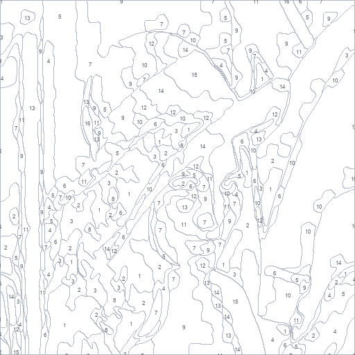
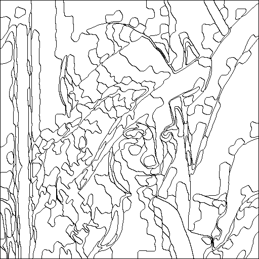
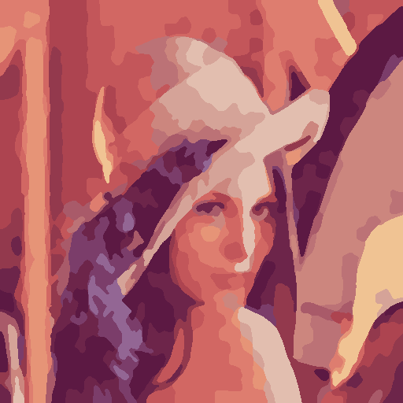

# Strokemap - Paint by Numbers Generator

A Python package and CLI tool to convert any image into a high-quality, print-ready "Paint by Numbers" PDF template.

The generated PDF matches premium standards, split into four cleanly laid-out pages:
1. **Page 1 - Numbered Template**: Light gray outlines with a small, centered index number in each region.
2. **Page 2 - Clean Outlines**: Clean black outlines without any numbers, perfect for clean canvas painting.
3. **Page 3 - Colorized Preview**: A color reference picture showing what the finished painting should look like.
4. **Page 4 - Color Palette Sheet**: A beautifully aligned grid of color swatches showing index numbers, hex codes, paint color blocks, and step-by-step instructions.

---

## Preview

Here is an example of the generator's output using the standard **Lenna** test image:

| Original Image | Numbered Template | Clean Outlines | Colorized Preview |
| :---: | :---: | :---: | :---: |
|  |  |  |  |

> [!NOTE]
> **Image Citation**: Lenna (or Lena) is a standard digital image processing test image, originally from the USC-SIPI Image Database. It is widely used for testing image processing algorithms.

---

## Installation

Ensure you have **Python 3.10 or newer** installed. You can install `strokemap` using one of the methods below:

### ⚡ Quick Start

You can install `strokemap` directly from PyPI:

```bash
pip install strokemap
```

Or install it from the local source directory:

```bash
pip install .
```

### 🛠️ Development Setup (Recommended)

To set up a virtual environment and install dependencies for development:

```bash
# 1. Clone the repository (if not already done)
git clone https://github.com/dipinknair/strokemap.git
cd strokemap

# 2. Create and activate a virtual environment
python3 -m venv .venv
source .venv/bin/activate

# 3. Install the package in editable mode with development dependencies
pip install -e ".[dev]"

# 4. Install pre-commit hooks for linting
pre-commit install
```

> [!TIP]
> If you are using Windows, activate the virtual environment with:
> `.venv\Scripts\activate`

### 📦 Dependencies

The installation automatically handles the following core dependencies:
- **`numpy`**: Numerical array operations
- **`pillow`**: Image loading and saving
- **`opencv-python`**: Outline detection and distance transform
- **`scikit-learn`**: K-Means clustering for color quantization
- **`scikit-image`**: SLIC superpixel segmentation
- **`reportlab`**: Premium multi-page PDF generation

---

## Usage

### Command Line Interface

You can convert any image directly from your terminal:

```bash
strokemap input.jpg output.pdf --colors 20 --difficulty medium
```

#### CLI Options:
* `image_path` (required): Path to the input image file.
* `output_pdf` (required): Path where the final PDF should be saved.
* `-c`, `--colors` (optional): Target number of colors (default: 20).
* `-d`, `--difficulty` (optional): Level of region detail (`easy`, `medium`, `hard`) (default: `medium`).

### Python API

You can also use the package programmatically:

```python
from strokemap import PaintByNumbersGenerator, generate_pdf

# 1. Initialize generator with difficulty settings
generator = PaintByNumbersGenerator(difficulty="medium")

# 2. Process image to get templates and palette
numbered_img, clean_img, colorized_img, palette = generator.process("input.jpg", n_colors=20)

# 3. Compile everything into a 4-page A4 PDF
generate_pdf(
    output_pdf_path="output.pdf",
    numbered_img=numbered_img,
    clean_img=clean_img,
    colorized_img=colorized_img,
    palette=palette,
)
```

---

## Algorithms Used

1. **Superpixel Segmentation (SLIC)**: Uses the Simple Linear Iterative Clustering (SLIC) algorithm to cluster pixels into contiguous, edge-conforming "superpixels". This ensures that the boundaries of regions natively stick to the actual physical boundaries and details in the image (such as eyes, text, and fine lines).
2. **Color Quantization**: Performs K-Means clustering on the average colors of the superpixels in the CIELAB color space. Working in CIELAB space allows color distances to match human perception, resulting in a vibrant and accurate palette.
3. **Detail Reduction & Region Merging**: Small, hard-to-paint micro-regions are intelligently merged into their dominant neighbor using connected components analysis, with thresholds dynamically adjusted by the selected difficulty level.
4. **Outline Extraction**: Computes a pixel-wise transition grid to produce clean, single-pixel outlines.
5. **Optimal Label Placement**: Uses a distance transform (`cv2.distanceTransform`) to find the center of the largest inscribed circle within each region, placing number labels at the most readable point.

---

## Authors

For additional author and maintainer details, see [AUTHORS.md](AUTHORS.md).

## Contributors

This project is maintained by the community. See [CONTRIBUTORS.md](CONTRIBUTORS.md) for the current list of contributors and how to get involved.

## Contributing

Contributions are welcome! Please read [CONTRIBUTING.md](CONTRIBUTING.md) before opening an issue or pull request.

## Security

If you discover a vulnerability, please do not publish it publicly. Refer to [SECURITY.md](SECURITY.md) for our security reporting policy.
